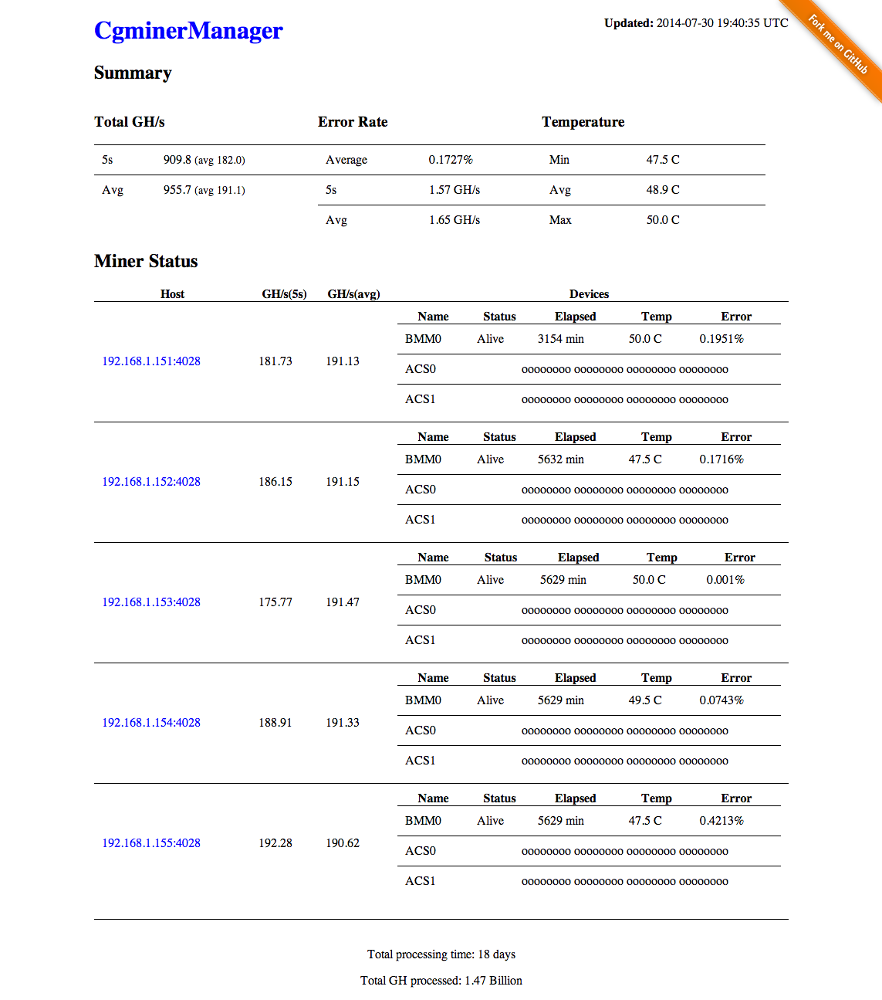

# CgminerManager

A Rails web manager for cgminer instances.

## Note

This application is intended to only be used on a secure local network. By default, it will only allow access from 127.0.0.1.

## Requirements

* Ruby (1.9.3+)
* bundler (1.6.0+)
* [cgminer\_api\_client](https://github.com/jramos/cgminer_api_client) (0.0.1+)

## Installation

Clone this repository.

    git clone git@github.com:jramos/cgminer_manager.git
    cd cgminer_manager
    bundle install

## Configuration

Copy ``config/miners.yml.example`` to ``config/miners.yml`` and update with the IP addresses (and optional ports) of your cgminer instances. E.g.

    # connect to localhost on the default port (4028)
    - host: 127.0.0.1
    # connect to 192.168.1.1 on a non-standard port (1234)
    - host: 192.168.1.1
      port: 1234

### Remote API Access

If connecting to a cgminer instance on any host other than 127.0.0.1, remote API access must be enabled. See [cgminer\_api\_client](https://github.com/jramos/cgminer_api_client) for more information.

### Page Refreshing

The main page of the site will refresh every 30 seconds by default. You can adjust this by editing `app/assets/javascripts/config.js`.

    var config = {
      // data reload interval in seconds
      reload_interval : 30
    }

## Running

Automatically:

    rake server

Manually:

    bundle exec rails server --binding=127.0.0.1

Connect to [http://127.0.0.1:3000/](http://127.0.0.1:3000/) in your browser.
  
  
## Screenshot

## Contributing

1. Fork it ( https://github.com/jramos/cgminer_manager/fork )
2. Create your feature branch (`git checkout -b my-new-feature`)
3. Commit your changes (`git commit -am 'Add some feature'`)
4. Push to the branch (`git push origin my-new-feature`)
5. Create a new Pull Request

## Donating

If you find this gem useful, please consider donating.

BTC: ``***REMOVED***``

## License

Code released under [the MIT license](LICENSE.txt).