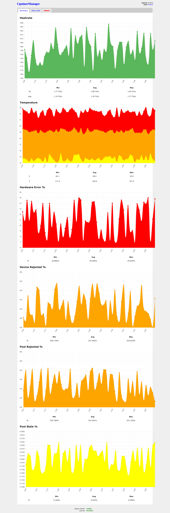
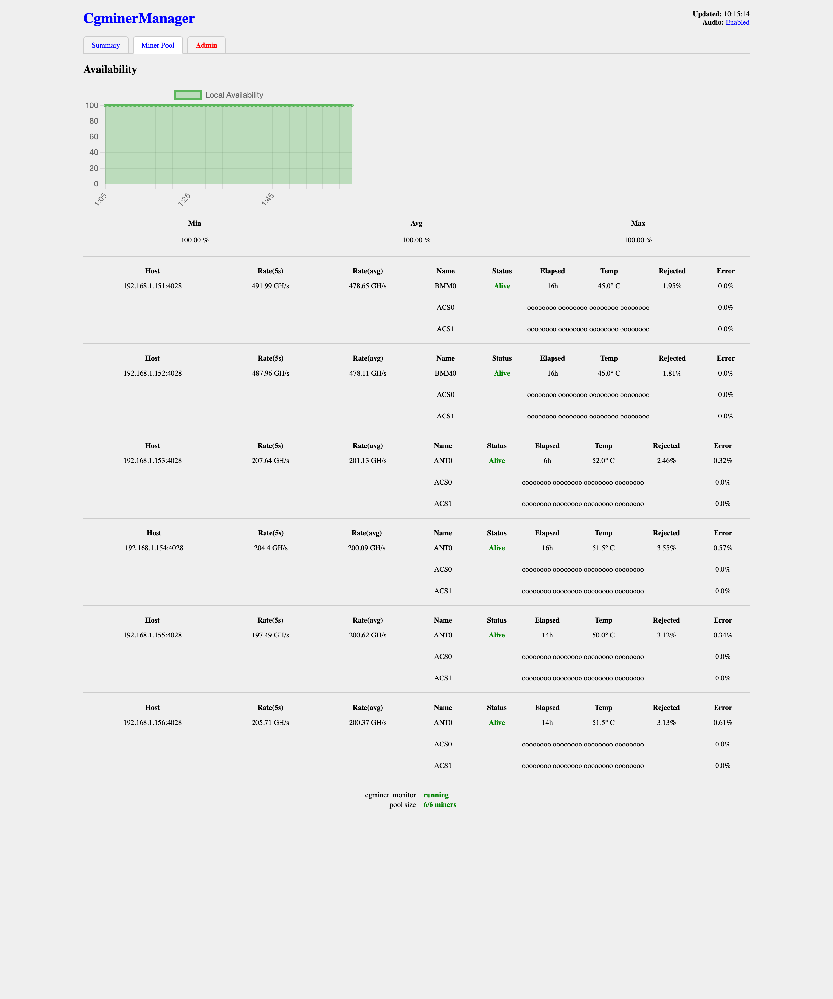
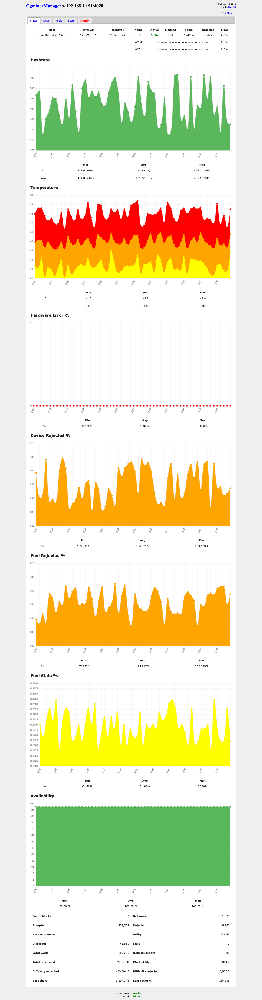
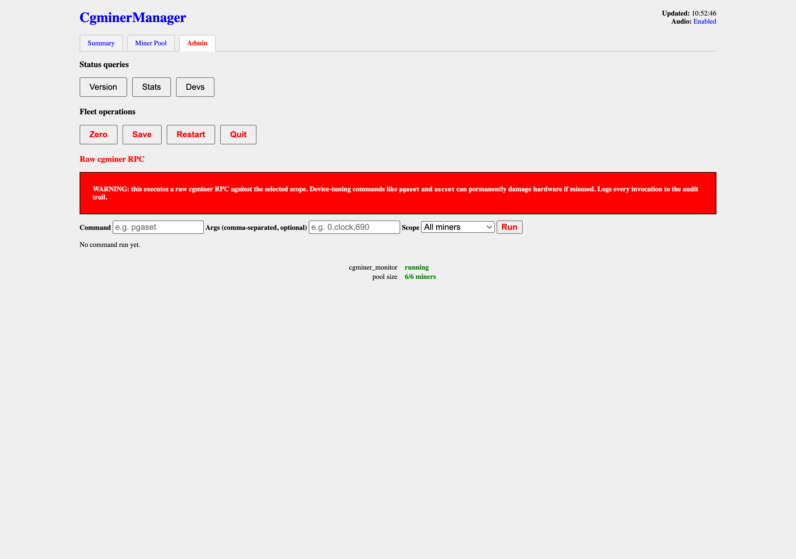

# cgminer_manager

Web UI for operating cgminer rigs. Displays data fetched from [`cgminer_monitor`](https://github.com/jramos/cgminer_monitor) and issues pool-management commands to miners via [`cgminer_api_client`](https://github.com/jramos/cgminer_api_client).

## Screenshots

### Pool summary



### Miner pool



### Miner detail



### Admin



Screenshots are generated from a scripted harness in `dev/screenshots/` — see that directory's README for how to regenerate.

## Requirements

- Ruby 3.2+ (4.0.2 recommended; see `.ruby-version`)
- A running `cgminer_monitor` instance exposing `/v2/*`
- MongoDB (used by `cgminer_monitor`, not directly by this service)

## Quick start (Docker)

Multi-arch images (`linux/amd64` + `linux/arm64`) are published from CI
to GHCR on every `v*` tag push:

```bash
docker pull ghcr.io/jramos/cgminer_manager:latest
# or pin to a specific release:
docker pull ghcr.io/jramos/cgminer_manager:1.3
```

Run with the provided compose stack:

```bash
export SESSION_SECRET=$(ruby -rsecurerandom -e 'puts SecureRandom.hex(32)')
cp config/miners.yml.example config/miners.yml
docker compose up
```

Open http://localhost:3000. The Admin tab at the top of the dashboard exposes
fleet operations (version / stats / devs / zero / save / restart / quit) and a
raw cgminer RPC form.

Admin routes require HTTP Basic Auth **by default** as of 1.3.0. Set both:

```bash
export CGMINER_MANAGER_ADMIN_USER=admin
export CGMINER_MANAGER_ADMIN_PASSWORD=$(ruby -rsecurerandom -e 'puts SecureRandom.hex(24)')
docker compose up
```

Without credentials, `cgminer_manager run` fails to start with a `ConfigError`.
To deliberately run the open/CSRF-only posture (e.g., developer loopback or an
isolated lab network), set `CGMINER_MANAGER_ADMIN_AUTH=off`. `docker-compose.yml`
defaults to this escape hatch for dev; the e2e stack requires a password.

## Manual install

```bash
git clone https://github.com/jramos/cgminer_manager.git
cd cgminer_manager
bundle install
cp config/miners.yml.example config/miners.yml
# point at a running cgminer_monitor:
export CGMINER_MONITOR_URL=http://localhost:9292
export SESSION_SECRET=$(ruby -rsecurerandom -e 'puts SecureRandom.hex(32)')
bin/cgminer_manager doctor
bin/cgminer_manager run
```

## Configuration

All settings come from environment variables.

| Variable | Required | Default | Notes |
|----------|----------|---------|-------|
| `CGMINER_MONITOR_URL` | yes | — | Base URL for `cgminer_monitor` (e.g., `http://localhost:9292`) |
| `MINERS_FILE` | | `config/miners.yml` | YAML list of `{host, port}` entries (optional `label` for display) |
| `PORT` | | `3000` | Listening port |
| `BIND` | | `127.0.0.1` | Listening interface |
| `SESSION_SECRET` | yes in production | generated in dev | Signs session cookies (CSRF) |
| `CGMINER_MANAGER_ADMIN_USER` | **yes by default** | — | HTTP Basic Auth username for `/admin/*` routes. Boot fails unless this and `CGMINER_MANAGER_ADMIN_PASSWORD` are both set, or `CGMINER_MANAGER_ADMIN_AUTH=off`. |
| `CGMINER_MANAGER_ADMIN_PASSWORD` | **yes by default** | — | HTTP Basic Auth password. Valid credentials also bypass CSRF (intended for scripts / curl). |
| `CGMINER_MANAGER_ADMIN_AUTH` | | unset | Set to `off` to deliberately disable admin auth (escape hatch for dev loopback / isolated lab networks). |
| `LOG_FORMAT` | | `text` (dev), `json` (prod) | |
| `LOG_LEVEL` | | `info` | `debug`, `info`, `warn`, `error` |
| `STALE_THRESHOLD_SECONDS` | | `300` | Tile "updated Xm ago" warning threshold |
| `SHUTDOWN_TIMEOUT` | | `10` | Seconds to wait for Puma to stop |
| `CGMINER_MANAGER_PID_FILE` | | unset | Path where `run` writes the server PID on boot and unlinks on shutdown. Required for `bin/cgminer_manager reload`; operators who prefer can still `kill -HUP <pid>` directly. |
| `CGMINER_MANAGER_RESTART_SCHEDULES_FILE` | | `data/restart_schedules.json` | JSON file backing per-miner daily restart schedules. Mutated by the UI; the directory is created on first write. |
| `CGMINER_MANAGER_RESTART_SCHEDULER` | | unset | Set to `off` to disable the scheduler thread (the routes still mutate the file — useful when running multiple managers behind a load balancer where only one should drive restarts). |

## CLI

- `bin/cgminer_manager run` — start the server.
- `bin/cgminer_manager doctor` — verify `miners.yml`, cgminer reachability, and monitor `/v2/miners`.
- `bin/cgminer_manager reload` — dry-run-parse `miners.yml`, then SIGHUP the running server (requires `CGMINER_MANAGER_PID_FILE`).
- `bin/cgminer_manager version` — print version.

### Hot reload

`miners.yml` is hot-reloadable — add, remove, or re-label a miner, then
either `kill -HUP $(cat $CGMINER_MANAGER_PID_FILE)` or
`bin/cgminer_manager reload`. The server logs `event=reload.ok` on
success or `event=reload.failed` (and keeps the old list) if the new
file fails to parse. Only `settings.configured_miners` reloads; other
`Config` fields (`CGMINER_MONITOR_URL`, `SESSION_SECRET`, log level,
etc.) still require a full restart to change.

### Errors and Exit Codes

| Code | Meaning |
|---|---|
| `0` | Clean shutdown (`run`), all checks passed (`doctor`), or normal completion (`version`). |
| `1` | `doctor`: at least one check failed. |
| `2` | Configuration error (missing `CGMINER_MONITOR_URL`, unreadable `miners.yml`, invalid `LOG_FORMAT`/`LOG_LEVEL`, etc.). |
| `64` | Unknown or missing CLI verb (`EX_USAGE`-ish). |

The gem's error taxonomy (all under `CgminerManager::Error < StandardError`):

-   `CgminerManager::ConfigError` — configuration validation failed at boot. The CLI translates this to exit 2.
-   `CgminerManager::MonitorError::ConnectionError` — couldn't reach `cgminer_monitor` (DNS, refused, timeout). Renders a "data source unavailable" banner on the dashboard; fails `doctor`.
-   `CgminerManager::MonitorError::ApiError` — monitor answered with a non-2xx response. Carries `status:` and `body:`. Same UI behavior as `ConnectionError`.
-   `CgminerManager::PoolManagerError::DidNotConverge` — a pool operation's post-write verification query saw an unexpected state. Caught internally and surfaced as `:indeterminate` in the per-miner result row (not raised to the caller).

## HTTP surface

- `GET /` — dashboard (Summary / Miner Pool / Admin tabs).
- `GET /miner/:miner_id` — per-miner page (Miner / Devs / Pools / Stats / Admin tabs). `:miner_id` is URL-encoded `host:port`.
- `GET /graph_data/:metric` — aggregate graph data across all miners. Returns a JSON array of rows.
- `GET /miner/:miner_id/graph_data/:metric` — per-miner graph data, same shape.
- `POST /manager/manage_pools`, `POST /miner/:miner_id/manage_pools` — pool management commands (CSRF-protected).
- `POST /manager/admin/:command` — typed fleet admin (`version`, `stats`, `devs`, `zero`, `save`, `restart`, `quit`). CSRF-protected; Basic Auth required by default (or `=off`).
- `POST /miner/:miner_id/admin/:command` — per-miner variant of the above.
- `POST /manager/admin/run` — raw cgminer RPC with `command` + `args` + `scope` params; `scope` is `all` or a configured `host:port`. Server-side rejects hardware-tuning verbs (`pgaset`, `ascset`, `pgarestart`, `ascrestart`, `pga{enable,disable}`, `asc{enable,disable}`) with `scope=all`.
- `POST /miner/:miner_id/admin/run` — raw RPC against a single miner (no scope=all restriction).
- `GET /miner/:miner_id/maintenance` — render the per-miner scheduled-restart form. Basic Auth required.
- `POST /miner/:miner_id/maintenance` — persist the schedule (CSRF + Basic Auth + rate-limited).
- `GET /api/v1/ping.json` — legacy probe, returns `{timestamp, available_miners, unavailable_miners}` computed directly from cgminers.
- `GET /api/v1/restart_schedules.json` — public read of every miner's restart schedule. Consumed by `cgminer_monitor` to suppress `offline` alerts during a scheduled restart window.
- `GET /healthz` — service health (manager + monitor reachability).

Supported graph metrics: `hashrate` (7 columns), `temperature` (4 columns), `availability` (2-3 columns).

### Raw RPC arg escaping caveat

`POST /manager/admin/run` passes `args` to `cgminer_api_client`'s `Miner#query` after `split(',')` on the raw string. **Commas inside argument values are not escapable through this form** — the split happens before the gem's own escape pass. This is not a practical limitation for any cgminer verb in common use (`pgaset`/`ascset` take numeric or option-name args without commas), and the typed `manage_pools` endpoints handle pool-related commands with credentials that may contain commas.

## Development

```bash
bundle install
bundle exec rake  # rubocop + rspec
```

## Security posture

Default bind is `127.0.0.1`. The service is designed for secure local networks; to expose it beyond localhost, put it behind a reverse proxy that provides authentication.

The Admin surface (`/manager/admin/*`, `/miner/:id/admin/*`) is CSRF-protected for the browser path and **required to be gated by HTTP Basic Auth by default** as of 1.3.0. Boot fails unless `CGMINER_MANAGER_ADMIN_USER` and `CGMINER_MANAGER_ADMIN_PASSWORD` are both set, or `CGMINER_MANAGER_ADMIN_AUTH=off` is set to deliberately disable. Valid Basic Auth bypasses CSRF — a static credential is strictly stronger proof than a session cookie + CSRF token, and this lets operators curl admin routes during incidents. `bin/cgminer_manager doctor` reports the active posture so audits can confirm which deployments are gated.

The typed admin button list (`version`/`stats`/`devs`/`zero`/`save`/`restart`/`quit`) is **ergonomic, not defensive**: anyone who can reach `/manager/admin/run` can execute any cgminer verb. The defensive layers are:

1. Basic Auth via the env vars above.
2. Scope restrictions on hardware-tuning verbs (`pgaset`/`ascset`/`pgarestart`/`ascrestart`/`pga{enable,disable}`/`asc{enable,disable}`) — the server refuses `scope=all` for these and the UI disables the `all` option when the command input matches.
3. Per-command audit logging (`admin.command`, `admin.raw_command`, `admin.result`, `admin.auth_failed`, `admin.auth_misconfigured`, `admin.scope_rejected`) with a `request_id` UUID threading entry and exit events for any given POST.

Basic Auth transmits credentials base64-encoded (reversible), so terminate TLS at a reverse proxy in any deployment where the UI is reachable beyond localhost.

### Rate limiting

As of 1.5.0, POSTs to admin + write paths (`/manager/admin/*`, `/miner/:id/admin/*`, `/manager/manage_pools`, `/miner/:id/manage_pools`) are throttled to 60 requests / 60 seconds per client IP. Anything over the limit receives `429 Too Many Requests` with a `Retry-After` header. The limiter sits above Basic Auth, so 401-probing attackers are throttled before `AdminAuth` ever runs.

Tuning env vars:

-   `CGMINER_MANAGER_RATE_LIMIT=off` — disable entirely (escape hatch; mirrors the admin-auth pattern).
-   `CGMINER_MANAGER_RATE_LIMIT_REQUESTS` — default `60`.
-   `CGMINER_MANAGER_RATE_LIMIT_WINDOW_SECONDS` — default `60`.

`bin/cgminer_manager doctor` reports the active limits.

**Behind nginx / a reverse proxy:** without proxy-trust config, every request appears to come from the proxy's IP and the limiter throttles the whole site globally. Set `CGMINER_MANAGER_TRUSTED_PROXIES` to the proxy's IP or CIDR (comma-separated list, e.g. `127.0.0.1/32,10.0.0.0/8`); the limiter then consults `X-Forwarded-For` and keys the bucket on the leftmost untrusted hop (the actual client). Pair with nginx config:

    location / {
        proxy_set_header Host              $host;
        proxy_set_header X-Real-IP         $remote_addr;
        proxy_set_header X-Forwarded-For   $proxy_add_x_forwarded_for;
        proxy_set_header X-Forwarded-Proto $scheme;
        proxy_pass http://127.0.0.1:3000;
    }

Implementation is a single-Puma-process in-memory bucket (Hash + Mutex). Cluster-mode Puma deployments would need a shared store (Redis or similar) that the bundled middleware intentionally does not include.

## Audit retention

`cgminer_manager` emits structured JSON to stdout; durable storage, rotation, and retention are the deployer's responsibility (systemd journald, Docker logging driver, or a log shipper like Vector / Fluent-Bit). Filter audit events with `event=admin.*` OR `event=rate_limit.exceeded` — the latter catches unauthenticated 401-probing because the rate limiter sits above the auth gate. See [`docs/logging.md`](docs/logging.md#audit-retention) for systemd / Docker / Vector recipes and [`cgminer_monitor/docs/log_schema.md`](https://github.com/jramos/cgminer_monitor/blob/develop/docs/log_schema.md) for the cross-repo log contract.

## Further Reading

-   [`CHANGELOG.md`](CHANGELOG.md) — release history: 1.0 Sinatra rewrite, 1.1 rich UI restoration, 1.2 admin surface restoration.
-   [`MIGRATION.md`](MIGRATION.md) — step-by-step upgrade from the 0.x Rails engine era.
-   [`AGENTS.md`](AGENTS.md) — context for AI coding assistants; also a useful conventions-and-extension guide for human contributors.
-   [`docs/`](docs/) — topic-split deep dives on architecture, components, interfaces, data models, workflows, and dependencies. Start with [`docs/index.md`](docs/index.md).
-   [`cgminer_monitor`](https://github.com/jramos/cgminer_monitor) and [`cgminer_api_client`](https://github.com/jramos/cgminer_api_client) — the upstream gems this service consumes. Operators frequently need to cross-reference them.

## Donating

If you find this application useful, please consider donating.

BTC: ``bc1q00genlpcpcglgd4rezqcurf4t4taz0acmm9vea``

## License

MIT. See LICENSE.txt.
