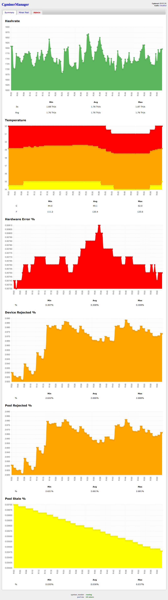
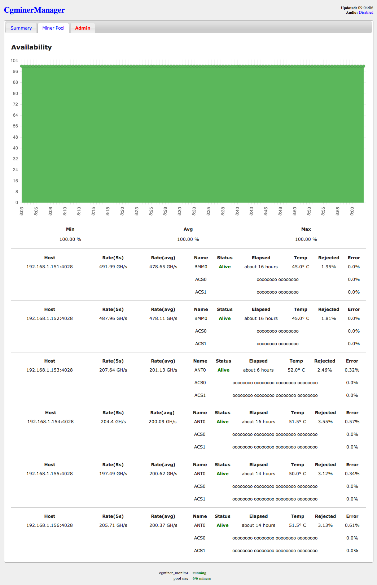
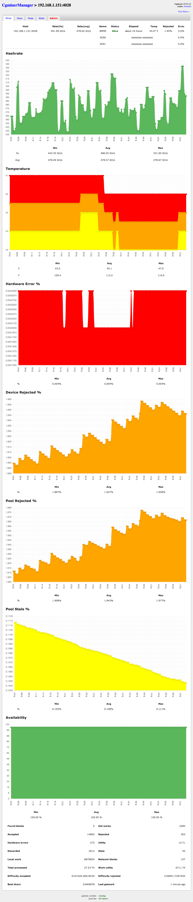

# CgminerManager

A web manager for cgminer written in Ruby on Rails. It allows for remote management and monitoring of a multiple cgminer instances. Features include:

* Pool and miner summary pages
* Breakdown of miner performance and configuration
* Quick updates to mining pool configuration
* Allows sending raw API commands to one or more miners
* Multi-command support; send API commands in bulk

## Screenshots

### Pool Summary

### Pool Detail

### Miner Detail

## Requirements

* [Ruby](https://www.ruby-lang.org) (~> 2.0.0, ~> 2.1.0)
* [bundler](http://bundler.io/) (~> 1.6.0)
* [mongodb](http://www.mongodb.org/) (~> 2.6)

## Dependencies

* [cgminer\_api\_client](https://github.com/jramos/cgminer_api_client) (~> 0.1.10)
* [cgminer\_monitor](https://github.com/jramos/cgminer_monitor) (~> 0.0.1)
* haml-rails (~> 0.5.3)
* jquery-rails (~> 3.1.1)
* jquery-ui-rails (~> 5.0.0)
* rails (= 4.1.4)
* rake (~> 10.3.2)
* sass-rails (~> 4.0.3)
* therubyracer (~> 0.12.1)
* thin (~> 1.6.2)
* uglifier (~> 2.5.3)

## Installation

    git clone git@github.com:jramos/cgminer_manager.git
    cd cgminer_manager
    bundle install

## Configuration

### mongodb

Copy [``config/mongoid.yml.example``](https://github.com/jramos/cgminer_manager/blob/master/config/mongoid.yml.example) to ``config/mongoid.yml`` and update as necessary.

    production:
      sessions:
        default:
          database: cgminer_monitor
          hosts:
            - localhost:27017

### cgminer\_api\_client

Copy [``config/miners.yml.example``](https://github.com/jramos/cgminer_manager/blob/master/config/miners.yml.example) to ``config/miners.yml`` and update with the IP addresses (and optional ports) of your cgminer instances. E.g.

    # connect to localhost on the default port (4028)
    - host: 127.0.0.1
    # connect to 192.168.1.1 on a non-standard port (1234)
    - host: 192.168.1.1
      port: 1234

### Remote API Access

If connecting to a cgminer instance on any host other than 127.0.0.1, remote API access must be enabled. See [cgminer\_api\_client](https://github.com/jramos/cgminer_api_client#remote-api-access) for more information.

### UI Options

You can adjust these options by editing `app/assets/javascripts/config.js`.

#### Page Refreshing

The data on each page of the site will refresh every minute (60 seconds) by default. You can adjust this via `reload_interval`. Change to 0 to disable refreshing.

    var config = {
      // data reload interval in seconds
      reload_interval : 300,  // 5 minutes
      
      // misc UI options
      show_github_ribbon: true
    }

#### Disable Fork Ribbon

To hide the "Fork Me" ribbon on the top right, change `show_github_ribbon` to false.

    var config = {
      // data reload interval in seconds
      reload_interval : 60,  // 1 minute
      
      // misc UI options
      show_github_ribbon: false
    }

## Running

### Note

This application is designed to be used on a secure local network. By default, it will only allow access from 127.0.0.1. Allowing access from other IP addresses is discouraged, since it would allow anyone on your local network and possibly the internet at large to run arbirary commands on your mining pool.

### Automatically

    rake server

### Manually

    env RAILS_ENV=production rake assets:clobber
    env RAILS_ENV=production rake assets:precompile
    env SECRET_KEY_BASE=`rake secret` bundle exec rails server thin -e production --binding=127.0.0.1

Connect to [http://127.0.0.1:3000/](http://127.0.0.1:3000/) in your browser.

## Updating

    git pull
    bundle install

## Contributing

1. Fork it ( https://github.com/jramos/cgminer_manager/fork )
2. Create your feature branch (`git checkout -b my-new-feature`)
3. Commit your changes (`git commit -am 'Add some feature'`)
4. Push to the branch (`git push origin my-new-feature`)
5. Create a new Pull Request

## Donating

If you find this application useful, please consider donating.

BTC: ``***REMOVED***``

## License

Code released under [the MIT license](LICENSE.txt).