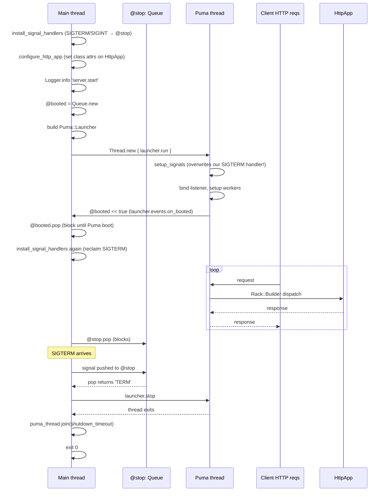
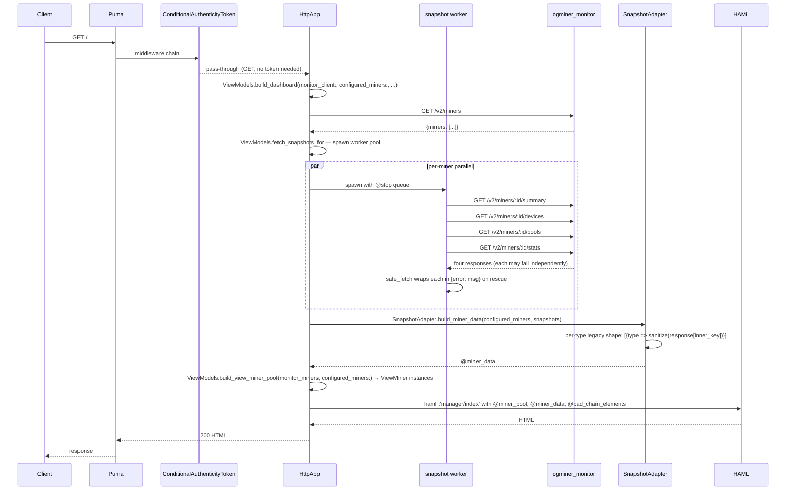
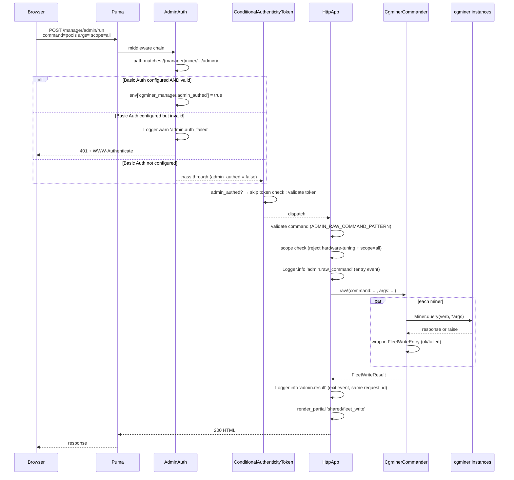
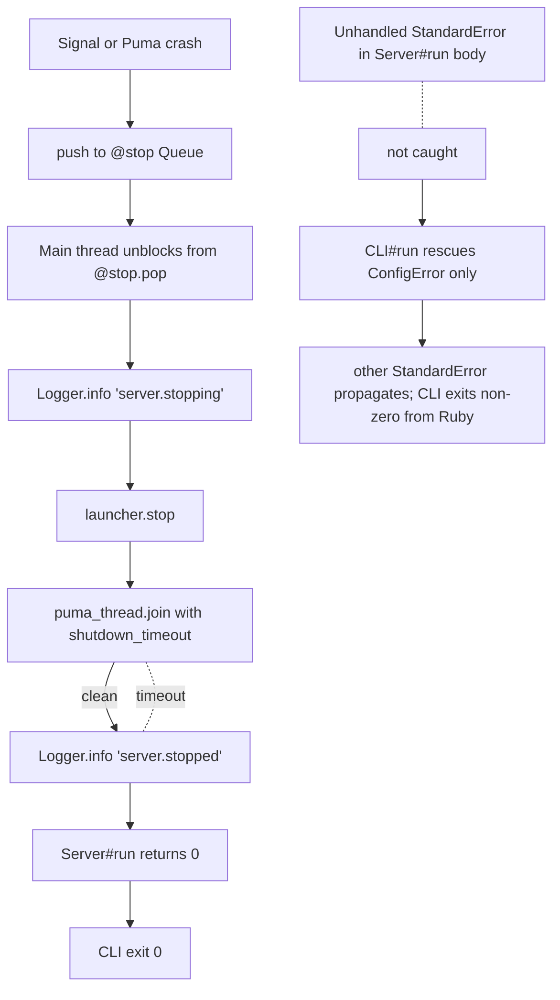

# Architecture

## Design goals

1. **One process, foreground, supervisor-driven.** No daemonize, no PID file, no `start`/`stop`/`restart` subcommands — only `run`. systemd / docker / launchd owns the lifecycle.
2. **Separation between read path and write path.** Read-path queries (dashboard, graphs, per-miner snapshots) all go through `cgminer_monitor` over HTTP. Write-path operations (pool management, admin RPC) go direct to cgminer instances over TCP via `cgminer_api_client`. Neither path shares connection state with the other.
3. **Thread-capped parallel fan-out.** A dashboard render with 10 miners fires 4 monitor requests per miner = 40 requests; a pool operation across 10 miners fires 10 TCP RPCs plus a save per miner = 20. Both paths bound concurrency via a `Queue + Mutex` worker pool to avoid thundering herds against upstream services (default 8 threads, tunable via `POOL_THREAD_CAP`).
4. **Structural error recovery for reads, explicit confirmation for writes.** A monitor tile that 5xx's renders "data source unavailable" banner without failing the whole dashboard. A pool operation returns a per-miner result envelope (`:ok`/`:failed`/`:indeterminate`) so the operator can see exactly what happened to each miner.
5. **`Config` is immutable at boot.** `Data.define`, validated once. Changing anything requires a restart. (One exception: the `AdminAuth` middleware reads its env vars per-request — see below.)
6. **Admin surface is defensive in depth.** CSRF + optional Basic Auth + scope restrictions + audit logging. Anyone who reaches `/manager/admin/run` can run any cgminer verb — the allowlist is *ergonomic* UI copy, not a security boundary.

## The single-thread HTTP execution model

**Why the two-step signal-handler install is subtle.** `Puma::Launcher#run` calls `setup_signals` synchronously inside the Puma thread, which blows away any SIGTERM/SIGINT handlers the main thread installed. So the dance is:

1. Main thread installs handlers (so a SIGTERM before Puma boot doesn't leave us in an inconsistent state).
2. Puma thread runs `setup_signals` (overwrites with Puma's).
3. `launcher.events.on_booted { booted << true }` fires when the listener is bound.
4. Main thread waits on `@booted.pop`.
5. Main thread re-installs handlers (Puma's are now replaced with ours).

Plus `raise_exception_on_sigterm false` — without it, Puma raises `SignalException` on SIGTERM inside its thread, bypassing our `@stop` queue entirely.

If you change how `Server` starts or stops Puma, re-verify that SIGTERM reliably routes through `@stop`.

## Request lifecycle (dashboard read)

**Key observations on the read path:**

- Each tile is fetched independently. If `monitor.pools(miner)` 5xxs but `monitor.summary(miner)` succeeds, the miner's row on the dashboard still renders — just with the Pools tab empty.
- `ViewModels.build_dashboard` rescues `MonitorError` *once at the top level*: if `monitor.miners` itself fails (can't even enumerate miners), we fall back to `miners.yml` as the list and set `banner: "data source unavailable"`.
- Snapshots are cached inside a single request via `Thread.new { ... fetch_tile ... }`; no request-to-request caching.
- The legacy HAML partials (pre-dating the 1.1 restoration) read the shape `@miner_data[i][:summary].first[:summary]` — nested-array-of-arrays with a type-keyed inner hash. That's why `SnapshotAdapter` exists: the monitor's `/v2/miners/:id/summary` envelope is `{miner:, command:, fetched_at:, ok:, response: {STATUS: [...], SUMMARY: [...]}, error:}`, but the partials expect `[{summary: [...]}]`. The adapter bridges that.

## Request lifecycle (admin write, raw RPC)

**Key observations on the write path:**

- Every admin POST gets a `request_id = SecureRandom.uuid` in the `before` filter. That ID threads through the entry event (`admin.command` or `admin.raw_command`), any rejection events (`admin.scope_rejected`, `admin.auth_failed`), and the exit event (`admin.result`). Grep the structured log by `request_id` to see the full story for one operation.
- `ADMIN_RAW_COMMAND_PATTERN = /\A[a-z][a-z0-9_+]*\z/` is the regex applied to the `command` param before anything else. No whitespace, no null bytes, no path traversal — but still permits every real cgminer verb.
- `SCOPE_RESTRICTED_VERBS` (`pgaset`/`ascset`/`pgarestart`/`ascrestart`/`pga{enable,disable}`/`asc{enable,disable}`) refuse `scope=all` with 422 + `admin.scope_rejected` log. The UI also disables the "all" option in the scope dropdown when the command input matches one of these, but the server-side check is the defensive layer.
- `args` is split on `,` before hitting `cgminer_api_client`'s own escape logic. That means commas inside argument values are not escapable through the form. Noted in the README.

## Request lifecycle (pool management)

Same shape as admin, but:

- Entry point is `POST /manager/manage_pools` or `POST /miner/:miner_id/manage_pools` with `action_name` ∈ `{enable, disable, remove, add}` and `pool_index` or `url/user/pass` params.
- No Basic Auth gate on pool routes — CSRF alone.
- Backed by `PoolManager` (not `CgminerCommander`).
- `PoolManager` runs the requested action, then verifies state (queries pools, checks the status matches expected) for `enable`/`disable`/`remove`. `add` is unverified (cgminer's `addpool` doesn't return the new index deterministically).
- Per-miner result has both `command_status` and `save_status` — because pool changes aren't persistent unless `save` is called. `save_status: :skipped` on failed commands.

## Graceful shutdown

`CLI#run` only rescues `ConfigError` (mapped to exit 2). Other errors that escape `Server#run` propagate as unhandled Ruby exceptions — the process dies and the supervisor restarts it. This is intentional: we don't want to silently paper over bugs in production.

## Design patterns

### Config as `Data.define`
`Config` is a 14-field immutable value object built from `ENV` via `Config.from_env`, validated in `validate!`, never mutated at runtime. No `attr_accessor`, no `reload!`. Same pattern as `cgminer_monitor`.

### Structured logging, stdout only
`Logger` is a module singleton with `info`/`warn`/`error`/`debug` class methods taking keyword args. Every event has an `event:` key for grep-ability. Writes JSON (default) or text via `$stdout`, thread-safe via `Mutex`. No `warn`/`puts`/`$stderr` calls anywhere in `lib/` — the CLI only writes to `$stderr` for its own config errors and usage hints.

### Queue-driven shutdown
A shared `@stop: Queue` is the rendezvous point for "time to stop." Signal handlers push to it; Puma thread crashes push to it (`@stop << 'puma_crash'`); main thread blocks on it. Same pattern as `cgminer_monitor`.

### App state in Sinatra settings
`Server#configure_http_app` populates `HttpApp` state via `HttpApp.set :key, value` for each of `monitor_url`, `miners_file`, `stale_threshold_seconds`, `pool_thread_cap`, `monitor_timeout_ms`, `session_secret`, `production`, and `configured_miners` (the last is eager-parsed via `HttpApp.parse_miners_file`). Routes read via `settings.foo`. Tests populate all of them in one call via `HttpApp.configure_for_test!(...)`. Sinatra settings are the idiomatic answer to "per-app configuration on class-level route blocks" — same singleton-per-class semantics as the class accessors they replaced, but with a consistent declaration shape.

### Thread-capped fan-out (two places)
Both `CgminerCommander` and `PoolManager` use the same pattern: a `Queue` pre-loaded with all miners, a fixed number of worker threads (min of `thread_cap` and `miners.size`), each popping with `queue.pop(true)` and writing to a shared `results` array under a `Mutex`. When the queue is drained, `queue.pop(true)` raises `ThreadError` and the worker breaks out of its loop.

Also appears in `ViewModels.fetch_snapshots_for` (different shape: tile-per-miner-hash instead of a result array).

### `SnapshotAdapter` as a shape-translation leaf
One module, four methods. Turns monitor's `/v2/miners/:id/:type` envelope into the `[{type => data}]` shape that legacy partials read. Key sanitization (`"MHS 5s"` → `:mhs_5s`, `"Device Hardware%"` → `:'device_hardware%'`) matches `cgminer_api_client::Miner#sanitized` — **not** cgminer_monitor's Poller normalization (which maps `%` to `_pct`; that rule only applies to time-series sample metadata). The adapter is a compatibility layer, not a general-purpose JSON transformer.

### `ConditionalAuthenticityToken`
Subclass of `Rack::Protection::AuthenticityToken` that short-circuits to `@app.call(env)` if `env['cgminer_manager.admin_authed']` is set. `AdminAuth` sets that flag when Basic Auth validates. The rationale: a valid static Basic Auth credential is strictly stronger proof than a session cookie + CSRF token, and this lets operators `curl` admin routes during incidents without scraping a CSRF token first.

### Ergonomic-vs-defensive distinction for admin verbs
The `ALLOWED_ADMIN_QUERIES` / `ALLOWED_ADMIN_WRITES` allowlists are *UI copy* for the one-click buttons — not a security boundary. Anyone who can reach `/manager/admin/run` can issue any cgminer verb. The real defensive layers are:
1. HTTP Basic Auth (via `CGMINER_MANAGER_ADMIN_USER`/`_PASSWORD`).
2. `SCOPE_RESTRICTED_VERBS` server-side rejection of `scope=all` for hardware-tuning commands.
3. `ADMIN_RAW_COMMAND_PATTERN` regex.
4. Audit logging per request with `request_id` threading.

If you add a new "dangerous" admin verb, add it to `SCOPE_RESTRICTED_VERBS` — don't just trust the UI to disable `scope=all`.

### `ViewMiner` / `ViewMinerPool` value types for HAML partials
Legacy partials expected to receive `CgminerApiClient::Miner` instances with `.host`, `.port`, `.available?`, `.to_s`. Now the data comes from monitor's `/v2/miners` response. `ViewMiner` is a `Data.define` with the same public surface, built from the monitor data via `ViewMiner.build(host, port, available, label)`. Value-equality matters because `_warnings.haml` does `@bad_chain_elements.uniq!` — `Data.define` gives this for free.

## Admin audit log schema

All admin POSTs emit (at minimum) one entry event and one exit event, threaded by `request_id`:

| Event | When | Fields |
|---|---|---|
| `admin.command` | on typed-allowlist POST | `request_id`, `user`, `remote_ip`, `user_agent`, `session_id_hash`, `command`, `scope` |
| `admin.raw_command` | on `/admin/run` POST | same as above + `args` |
| `admin.result` | after the commander returns | `request_id`, `command`, `scope`, `ok_count`, `failed_count`, `elapsed_ms` |
| `admin.scope_rejected` | 422 from scope check | `request_id`, `command`, `scope` |
| `admin.auth_failed` | 401 from `AdminAuth` | `reason` (`missing_creds`/`bad_creds`/`user_mismatch`), `path`, `remote_ip`, `user_agent` |

`session_id_hash` is a 12-char SHA256 prefix of the session ID — stable enough to correlate across requests, short enough to not leak the full session ID into logs.

Grep `request_id=<uuid>` to get the full story of one operation.
