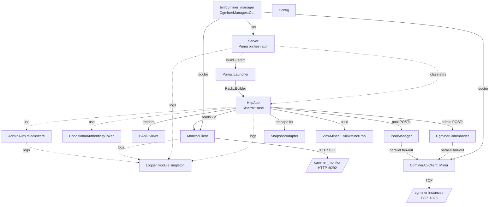

# Codebase Info

## What this is

`cgminer_manager` is a **Sinatra web UI** for operating cgminer mining rigs. It ships as a gem (`gem install cgminer_manager`) with a single executable (`cgminer_manager`) that runs a self-hosted Puma server serving a dashboard (`/`), per-miner pages (`/miner/:id`), pool-management forms, and a locked-down admin surface. Screenshots in `public/screenshots/` show the rendered pages.

It is **not** a library — nobody `require`s it from their own code. It is invoked through its CLI only.

It sits at the **top** of the three-gem chain:

- `cgminer_api_client` (TCP client for cgminer's JSON API) — used directly for write-path operations (pool management, admin RPC).
- `cgminer_monitor` (daemon that polls cgminer and exposes HTTP + MongoDB-backed metrics) — used for the read path (dashboard, graphs, per-miner snapshots).
- `cgminer_manager` (this repo) — orchestrates the UI on top of both.

The 1.0 rewrite (April 2026) moved this from a Rails 4.2 engine to a standalone Sinatra service. The 1.1 release restored the rich dashboard / per-miner UI on top of the new architecture. The 1.2 release restored (and hardened) the admin surface.

## Stack

- **Language:** Ruby 3.2+ (gemspec floor). `.ruby-version` pins to 4.0.2 for local dev.
- **CI matrix:** Ruby 3.2 / 3.3 / 3.4 required. Nightly best-effort job (see `.github/workflows/nightly.yml`) tests Ruby 4.0 / head.
- **Web framework:** Sinatra 4.0 + `sinatra-contrib` (for `content_for`).
- **HTTP server:** Puma 6.4, single-process, 1–8 threads, embedded via `Puma::Launcher`.
- **Template engine:** HAML 6.
- **HTTP client (upstream):** `http` gem 5.2 (not Faraday, not Net::HTTP).
- **Security middleware:** `rack-protection` 4.0 (CSRF), with a subclassed `ConditionalAuthenticityToken` that skips for Basic-Auth-authenticated admin requests.
- **Session:** `Rack::Session::Cookie`, signed with `SESSION_SECRET`.
- **Runtime gem deps:** `cgminer_api_client ~> 0.3`, `sinatra ~> 4.0`, `sinatra-contrib ~> 4.0`, `puma ~> 6.4`, `haml ~> 6.3`, `http ~> 5.2`, `rack-protection ~> 4.0`. No MongoDB, no database.
- **Dev deps:** `rspec`, `webmock`, `rack-test`, `rubocop` (+ `-rake`, `-rspec`), `rake`, `simplecov`. Plus a pinned `parallel < 2.0` so Ruby 3.2 can still bundle (transitive dep of rubocop).
- **Test framework:** RSpec. Unit specs at `spec/cgminer_manager/**`, integration specs at `spec/integration/**` (tagged `:integration`). WebMock + a real TCP FakeCgminer for end-to-end.
- **Lint:** RuboCop with `TargetRubyVersion: 3.2`. `Metrics/ClassLength` raised to 550 to accommodate `HttpApp`. Default rake task runs `[rubocop, spec]`.
- **Containerization:** multi-stage Dockerfile (`ruby:3.4-slim` base) and `docker-compose.yml` bundling manager + cgminer_monitor + Mongo.

## Directory layout

```
cgminer_manager/
├── bin/
│   └── cgminer_manager              # CLI entrypoint: delegates to CgminerManager::CLI.run(ARGV)
├── lib/
│   ├── cgminer_manager.rb           # require graph only
│   └── cgminer_manager/
│       ├── admin_auth.rb            # AdminAuth middleware + ConditionalAuthenticityToken
│       ├── cgminer_commander.rb     # Thread-cap fan-out for fleet admin RPC (reads + writes)
│       ├── cli.rb                   # CLI dispatch: run / doctor / version + exit codes
│       ├── config.rb                # Data.define Config, from_env, validate!
│       ├── errors.rb                # Error, ConfigError, MonitorError {Connection, Api}, PoolManagerError
│       ├── fleet_query_result.rb    # FleetQueryEntry + FleetQueryResult (Data.define)
│       ├── fleet_write_result.rb    # FleetWriteEntry + FleetWriteResult (Data.define)
│       ├── http_app.rb              # Sinatra app: 14 routes, helpers, view-model builders (~700 LOC)
│       ├── logger.rb                # Structured JSON/text logger (module singleton, thread-safe)
│       ├── monitor_client.rb        # HTTP client for cgminer_monitor /v2/*
│       ├── pool_manager.rb          # PoolManager + MinerEntry + PoolActionResult (Data.define)
│       ├── server.rb                # Orchestrator: signals, Puma launcher, shutdown
│       ├── snapshot_adapter.rb      # Monitor /v2/* envelope → legacy HAML shape translator
│       ├── version.rb               # VERSION = "1.2.0"
│       └── view_miner.rb            # ViewMiner + ViewMinerPool (Data.define value types for partials)
├── views/                           # HAML templates (NOT packaged? yes — gemspec includes views/**/*)
│   ├── layout.haml
│   ├── _header.haml, _footer.haml
│   ├── manager/ (_summary, _miner_pool, _admin, index)
│   ├── miner/ (_summary, _devices, _pools, _stats, _admin, show)
│   ├── shared/ (_fleet_query, _fleet_write, _manage_pools, _miner_devices_table,
│   │            _miner_hashrate_table, _warnings, graphs/{_hashrate, _temperature,
│   │            _hardware_error, _device_rejected, _pool_rejected, _pool_stale,
│   │            _availability})
│   └── errors/ (404, 500)
├── public/                          # Static assets served by Puma (packaged)
│   ├── 404.html, 422.html, 500.html  # Rack-level fallbacks
│   ├── audio/warning.mp3
│   └── robots.txt
│   (css/, js/, screenshots/, fonts/ are present on-disk but excluded from this tree
│    listing — they're the Chart.js assets, stylesheet bundle, and release screenshots)
├── config/
│   ├── miners.yml.example           # [{ host, port, [label] }]
│   ├── puma.rb                      # Puma config (not used by `run`; Server#build_puma_launcher
│   │                                 # constructs its own. Kept for `rackup` / `puma` direct invocations.)
├── config.ru                        # Rack entrypoint — mirrors build_puma_launcher without signals/shutdown
├── spec/
│   ├── spec_helper.rb               # SimpleCov + WebMock + load support/**
│   ├── cgminer_manager/             # Unit specs (11 files, one per lib/)
│   ├── integration/                 # 13 HTTP-level specs tagged :integration
│   ├── fixtures/monitor/*.json      # Canned monitor /v2/* responses
│   └── support/
│       ├── cgminer_fixtures.rb      # Shared with cgminer_api_client and monitor
│       ├── fake_cgminer.rb          # Shared in-process TCP server for integration specs
│       └── monitor_stubs.rb         # WebMock helpers that stub monitor's /v2/*
├── dev/
│   └── screenshots/                 # Scripted harness for regenerating public/screenshots/*.png
│       ├── fake_cgminer_fleet.rb    # Launches 6 TCP listeners on 127.0.0.1:40281-40286
│       ├── fake_monitor.rb          # Stand-in monitor process for the harness
│       ├── scenario.rb              # Drives Playwright through the UI and captures pages
│       ├── boot.sh, teardown.sh
│       └── miners.yml
├── .github/workflows/
│   ├── ci.yml                       # lint + test matrix + integration jobs
│   └── nightly.yml                  # Ruby 4.0 / head experimental runs
├── .rubocop.yml
├── .rspec
├── .ruby-version                    # 4.0.2 (local dev; gemspec allows 3.2+)
├── Rakefile                         # default: [rubocop, spec]; plus spec:refresh_monitor_fixtures
├── Gemfile
├── cgminer_manager.gemspec
├── docker-compose.yml               # manager + monitor + mongo
├── Dockerfile                       # multi-stage, ruby:3.4-slim base
├── CHANGELOG.md                     # Keep-a-Changelog; 1.2.0 → 1.0.0 entries
├── MIGRATION.md                     # 0.x Rails → 1.0 Sinatra upgrade guide
├── README.md
└── LICENSE.txt                      # MIT
```

**What's packaged in the gem** (via the gemspec `spec.files` glob): `lib/**/*`, `views/**/*`, `public/**/*`, `bin/*`, `config/*.example`, `config/puma.rb`, `config.ru`, README, MIGRATION, CHANGELOG, LICENSE. Notably **not** packaged: `spec/`, `dev/`, `.github/`, `Dockerfile`, `docker-compose.yml`, `docs/`.

## Languages and tooling

| | |
|---|---|
| Primary language | Ruby |
| Templating | HAML 6 |
| Static assets | Plain CSS + JS (Chart.js), served from `public/` — no asset pipeline, no bundler |
| Build tool | `bundler`, `rake` (default task), `docker` |
| Package format | RubyGem (`.gem`) + Docker image |
| Distribution | RubyGems.org; Docker image not yet pushed to a registry |

## High-level module graph



## Key facts worth knowing up front

1. **Two upstreams: HTTP to monitor, TCP to cgminer.** Read path goes through `MonitorClient` (HTTP). Write path goes direct to cgminer via `cgminer_api_client` (TCP). The manager never writes to Mongo and never reads cgminer directly for UI tiles.
2. **Single-process, foreground, supervisor-driven.** No background workers. No daemonize. `cgminer_monitor run` (the CLI verb here is just `cgminer_manager run`) blocks until SIGTERM/SIGINT, then exits 0.
3. **`Config` is immutable** (`Data.define`). Validated once at boot. No hot reload. Exception: `AdminAuth` reads `CGMINER_MANAGER_ADMIN_USER` / `CGMINER_MANAGER_ADMIN_PASSWORD` per-request (intentional — lets dev harnesses toggle auth without restart).
4. **`HttpApp` state lives in Sinatra settings** set by `Server#configure_http_app` at boot: `settings.monitor_url`, `settings.miners_file`, `settings.stale_threshold_seconds`, `settings.pool_thread_cap`, `settings.monitor_timeout_ms`, `settings.session_secret`, `settings.production`, and `settings.configured_miners` (eagerly parsed via `HttpApp.parse_miners_file`). Tests populate them via `HttpApp.configure_for_test!(monitor_url:, miners_file:, ...)`.
5. **CgminerCommander + PoolManager both use thread-cap fan-out** via `Queue` + `Mutex`. Default cap is 8. Configurable via `POOL_THREAD_CAP`. Scoped to the request lifecycle; no persistent thread pool.
6. **`CgminerApiClient::Miner.to_s` is monkey-patched** in `http_app.rb` to return `"host:port"` so result rows display a stable identifier. Upstream's `Miner` doesn't define `to_s`; `respond_to_missing?` excludes `to_*`, so this is safe.
7. **Admin surface has three defensive layers.** In order: (1) CSRF for browser path, (2) optional HTTP Basic Auth when both `CGMINER_MANAGER_ADMIN_USER` and `CGMINER_MANAGER_ADMIN_PASSWORD` are set — valid Basic Auth bypasses CSRF, (3) scope restrictions on hardware-tuning verbs (`pgaset`/`ascset`/etc. refuse `scope=all`). Plus per-request audit logging threaded by `request_id`.
8. **No OpenAPI spec.** Unlike `cgminer_monitor`, the HTTP surface here is not documented as an OpenAPI document. Routes are defined only in `http_app.rb`. If you add one, add the corresponding CI parity check too.

## Version and release posture

- Current release: **1.2.0** (2026-04-17). See `CHANGELOG.md` for the 1.0 / 1.1 / 1.2 release notes.
- Semantic Versioning. 1.0 drew a line under the 0.x Rails-engine era. `v0-legacy` tag preserves the final Rails commit for rollback.
- `rubygems_mfa_required` is set in gemspec metadata.
- `Gemfile.lock` is `.gitignore`d — this gem expects consumers to generate their own.
