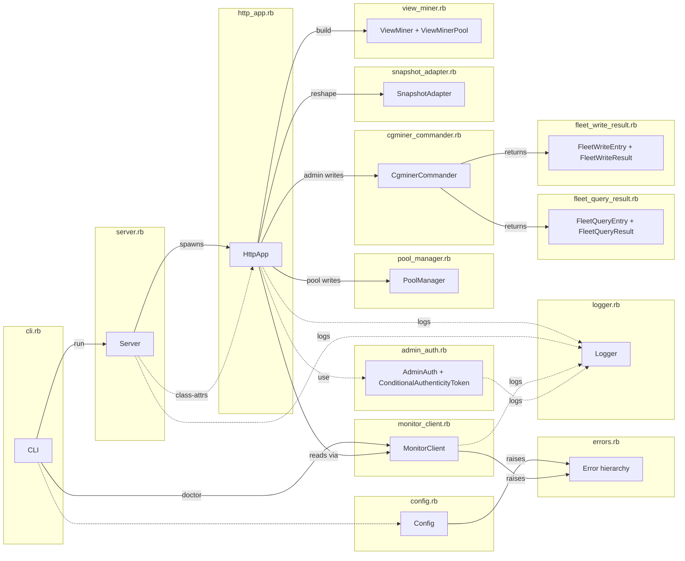

# Components

Every major component lives in a single file under `lib/cgminer_manager/`. No service registry, no dependency injection container. Components are plain Ruby classes, modules, or `Data.define` value objects composed directly.

## Component map

## Component list

### `CgminerManager` (module)
**File:** `lib/cgminer_manager.rb`

Top-level namespace. The file is only `require_relative` statements for the other files, in dependency order. No code other than the requires.

### `CgminerManager::Error` and siblings
**File:** `lib/cgminer_manager/errors.rb`

Error hierarchy:

- `Error < StandardError` — base class. Catch to rescue anything gem-specific.
- `ConfigError < Error` — bad env var, missing `miners.yml`, invalid log level/format. Mapped to CLI exit 2.
- `MonitorError < Error` — base for errors talking to cgminer_monitor.
  - `MonitorError::ConnectionError < MonitorError` — can't reach monitor (DNS, refused, timeout).
  - `MonitorError::ApiError < MonitorError` — monitor answered with non-2xx. Carries `status:` and `body:` readers.
- `PoolManagerError::DidNotConverge < Error` — a pool operation's verification step failed (the observed state didn't match the expected state after the write).

### `CgminerManager::Config` (`Data.define`)
**File:** `lib/cgminer_manager/config.rb`

14-field immutable config built from ENV. Fields: `monitor_url`, `miners_file`, `port`, `bind`, `log_format`, `log_level`, `session_secret`, `stale_threshold_seconds`, `shutdown_timeout`, `monitor_timeout`, `pool_thread_cap`, `rack_env`.

Public surface:
- `Config.from_env(env = ENV)` — build and validate in one call. Raises `ConfigError` on bad values.
- `#validate!` — asserts `monitor_url` present, `miners_file` exists on disk, `log_format ∈ {json, text}`, `log_level ∈ {debug, info, warn, error}`.
- `#load_miners` — parses `miners_file` into `[[host, port], ...]`, defaulting port to 4028.
- `#production?` — `rack_env == 'production'`.

Env mapping defaults: `PORT` 3000, `BIND` 127.0.0.1, `LOG_FORMAT` 'text' in dev / 'json' in prod, `LOG_LEVEL` info, `STALE_THRESHOLD_SECONDS` 300, `SHUTDOWN_TIMEOUT` 10, `MONITOR_TIMEOUT_MS` 2000, `POOL_THREAD_CAP` 8.

`SESSION_SECRET` resolution: env value if set, else raises in production, else a generated `SecureRandom.hex(32)` in dev with a stderr warning.

### `CgminerManager::Logger` (module singleton)
**File:** `lib/cgminer_manager/logger.rb`

Same shape as cgminer_monitor's logger. Module-level `info`/`warn`/`error`/`debug` taking keyword args, automatic `ts` and `level` fields, JSON (default) or text output, thread-safe via `Mutex`. `$stdout` by default; overridable via `Logger.output=` for tests.

### `CgminerManager::CLI`
**File:** `lib/cgminer_manager/cli.rb`

CLI dispatch. `CLI.run(argv)` is the bin-script entry point.

Verbs:

| Verb | Behavior | Exit code |
|---|---|---|
| `run` | `Config.from_env` → set `Logger.format`/`level` → `Server.new(config).run` | 0 on clean shutdown (forwarded from `Server#run`) |
| `doctor` | `Config.from_env` → check monitor `/v2/miners` → check each miner is TCP-reachable → verify each `miners.yml` entry is also in monitor's list | 0 if all checks pass, 1 otherwise |
| `version` | `puts CgminerManager::VERSION` | 0 |
| anything else | prints `unknown verb:` to stderr + usage line | 64 |

Top-level `rescue ConfigError` maps any `ConfigError` raised by `cmd_run` or `cmd_doctor` to exit 2 with a `config error: <msg>` line on stderr.

### `CgminerManager::Server`
**File:** `lib/cgminer_manager/server.rb`

Orchestrator for `run`. Owns the signal-handler dance, the Puma launcher, and the `@stop` queue.

Public surface: `Server.new(config)` and `#run` (returns exit code, always 0 in the happy path).

Key moves in `#run`:
1. `install_signal_handlers` (INT/TERM → `@stop << signal`).
2. `configure_http_app` — set class-level attrs on `HttpApp`.
3. Log `server.start`.
4. Set up `@booted = Queue.new`, build Puma launcher with `raise_exception_on_sigterm(false)`, spawn Puma thread that calls `launcher.run` (and pushes `'puma_crash'` to `@stop` on exception).
5. Wait for `@booted.pop` (set by `launcher.events.on_booted`).
6. `install_signal_handlers` again (Puma's `setup_signals` has overwritten ours).
7. `@stop.pop` — block until signal or crash.
8. `launcher.stop`, `puma_thread.join(shutdown_timeout)`, log `server.stopped`, return 0.

### `CgminerManager::HttpApp`
**File:** `lib/cgminer_manager/http_app.rb` (~650 LOC)

The Sinatra app. Inherits from `Sinatra::Base`, uses `Sinatra::ContentFor` helper. Pins `set :root` to the repo root so `public/` and `views/` resolve correctly (Sinatra's auto-detection would point at `lib/cgminer_manager/`).

App state set by `Server#configure_http_app` at boot via Sinatra settings:
- `settings.monitor_url`, `settings.miners_file`, `settings.stale_threshold_seconds`, `settings.pool_thread_cap`, `settings.monitor_timeout_ms`, `settings.session_secret`, `settings.production`.
- `settings.configured_miners` (eagerly parsed by `HttpApp.parse_miners_file`; `[[host, port, label]]` tuples).
- `HttpApp.configure_for_test!(...)` populates all of the above in one call for spec harnesses.

Middleware stack is installed by `HttpApp.install_middleware!`, which `Server#configure_http_app` (and `configure_for_test!`) calls *after* settings are populated so the operator's configured secret actually reaches Rack::Session::Cookie:
1. `Rack::Session::Cookie` signed with `settings.session_secret`, `same_site: :lax`, `secure: settings.production`.
2. `CgminerManager::AdminAuth` — gates `/manager|/miner/*/admin/*` routes when Basic Auth is configured.
3. `CgminerManager::ConditionalAuthenticityToken` — Rack::Protection CSRF with the admin-Basic-Auth bypass.

14 routes — see [`interfaces.md`](interfaces.md) for the full contract.

Error handlers:
- `not_found` → renders `views/errors/404.haml`.
- `error` → logs `http.500` with backtrace (first 10 lines), renders `views/errors/500.haml`.

Helpers in the `helpers do` block are scoped to HTTP concerns only: HTML escape, CSRF token, format_hashrate, number_with_delimiter, time_ago_in_words, staleness_badge, get_stats_for (mis-spelled Rails-era helpers preserved for compatibility with the legacy partials), plus URL builders (`miner_url`, `manager_admin_path`, etc.), `dispatch_pool_action` (reads `params[:url]/:user/:pass` for the add-pool branch), and `render_admin_result` (renders haml partials).

The pure view-model, fleet-factory, and admin-log-entry builders live in sibling modules. HttpApp keeps one-line delegating helpers so Haml templates that invoke `build_view_miner_pool(...)` etc. don't change.

**Class-eval monkey patch** at the top of the file: `CgminerApiClient::Miner.class_eval { def to_s = "#{host}:#{port}" }`. Makes `FleetWriteEntry.miner` and `PoolManager::MinerEntry.miner` (populated from `miner.to_s`) display stable "host:port" identifiers. Safe because upstream `Miner#respond_to_missing?` excludes `to_*` names, so adding `to_s` doesn't collide with `method_missing`.

### `CgminerManager::ViewModels`
**File:** `lib/cgminer_manager/view_models.rb`

Pure module. Functions take `monitor_client:`, `configured_miners:`, `stale_threshold_seconds:`, and `pool_thread_cap:` explicitly — no Sinatra dependency, so specs can exercise them without `Rack::Test`. Members: `build_view_miner_pool`, `build_view_miner_pool_from_yml`, `build_dashboard`, `build_miner_view_model`, `configured_labels_by_id`, `neighbor_ids`, `miner_configured?`, plus the private `fetch_snapshots_for` / `spawn_snapshot_worker` / `fetch_tile` / `safe_fetch` fan-out helpers.

### `CgminerManager::FleetBuilders`
**File:** `lib/cgminer_manager/fleet_builders.rb`

Pure module. Four factory methods — `pool_manager_for_all`, `pool_manager_for`, `commander_for_all`, `commander_for` — each taking `thread_cap:` explicitly (defaults a nil cap to 1 so a caller that forgets to supply it doesn't blow up deep inside threaded fan-out). Builds `CgminerApiClient::Miner` instances from either `[host, port, _label]` tuples or `host:port` id strings.

### `CgminerManager::AdminLogging`
**File:** `lib/cgminer_manager/admin_logging.rb`

Pure module. Three helpers: `session_id_hash(sid)` returns the 12-char SHA-256 slice used in audit logs; `command_log_entry(...)` and `result_log_entry(...)` build the two structured events (`admin.command` / `admin.raw_command` / `admin.result`) that `admin_spec.rb` asserts on. HttpApp threads request-scoped state (`request.env['cgminer_manager.admin_user']`, `request.ip`, etc.) in as kwargs.

### `CgminerManager::MonitorClient`
**File:** `lib/cgminer_manager/monitor_client.rb`

HTTP client for cgminer_monitor's `/v2/*` API. Uses the `http` gem.

Public surface:
- `MonitorClient.new(base_url:, timeout_ms: 2000)`.
- `#miners` — `GET /v2/miners`.
- `#summary(id)`, `#devices(id)`, `#pools(id)`, `#stats(id)` — `GET /v2/miners/:id/<type>`. `id` is CGI-escaped.
- `#graph_data(metric:, miner_id: nil, since: nil)` — `GET /v2/graph_data/:metric` with optional query params.
- `#healthz` — `GET /v2/healthz`.

All methods return the parsed JSON body with `symbolize_names: true` on success. On error:
- `HTTP::ConnectionError`, `HTTP::TimeoutError`, `Errno::ECONNREFUSED` → rewrap as `MonitorError::ConnectionError` with "monitor unreachable: …" message.
- Non-2xx HTTP response → `MonitorError::ApiError` with `status:` and `body:`.

Every call logs `monitor.call` with url, status, and `duration_ms`. Failures log `monitor.call.failed` with error class + message.

The `timeout_ms:` argument flows from `MONITOR_TIMEOUT_MS` env → `Config#monitor_timeout` → `settings.monitor_timeout_ms` (written in `Server#configure_http_app`) → `MonitorClient.new` in `HttpApp#monitor_client`.

### `CgminerManager::CgminerCommander`
**File:** `lib/cgminer_manager/cgminer_commander.rb`

Parallel fan-out for fleet admin RPC. Used by `/manager/admin/*` and `/miner/:id/admin/*` routes.

Public surface:
- `CgminerCommander.new(miners:, thread_cap: 8)` — `miners` is `[CgminerApiClient::Miner, ...]`.
- Read methods → `FleetQueryResult`: `#version`, `#stats`, `#devs`.
- Write methods → `FleetWriteResult`: `#zero!`, `#save!`, `#restart!`, `#quit!`, `#raw!(command:, args: nil)`.

`raw!` splits `args` on `,` and passes the positional array to `Miner#query`. Any `CgminerApiClient::{ConnectionError, TimeoutError, ApiError}` gets captured into the entry's `error:` field rather than re-raised, so one bad miner doesn't fail the whole fan-out.

Private `fan_out` helper: same pattern as `PoolManager#run_each` — `Queue` pre-loaded with miners, fixed worker count (`min(thread_cap, miners.size)`), results written into a fixed-size array under a `Mutex`, workers exit their loop when `queue.pop(true)` raises `ThreadError`.

### `CgminerManager::PoolManager`
**File:** `lib/cgminer_manager/pool_manager.rb`

Parallel fan-out for pool-management operations. Used by `/manager/manage_pools` and `/miner/:id/manage_pools` routes.

Inner types (both `Data.define`):
- `MinerEntry(:miner, :command_status, :command_reason, :save_status, :save_reason)` — `#ok?` returns true only when both statuses are `:ok`. `#failed?` is true if `command_status == :failed`.
- `PoolActionResult(:entries)` — `#all_ok?`, `#any_failed?`, `#successful`, `#failed`, `#indeterminate`.

Public methods (all return `PoolActionResult`):
- `#disable_pool(pool_index:)`, `#enable_pool(pool_index:)`, `#remove_pool(pool_index:)` — **verified**. Runs the write, then queries pools to confirm the state matches expected (`'Alive'` / `'Disabled'` / absent). Raises `PoolManagerError::DidNotConverge` internally, captured as `:indeterminate` in the entry.
- `#add_pool(url:, user:, pass:)` — **unverified**. cgminer's `addpool` response doesn't return the new index deterministically, so there's no practical verification.
- `#save` — pure save with no write before it.

`run_verified` vs `run_unverified` helpers handle the save-after-command dance. `save_status` is `:skipped` when the command failed (no point saving an unchanged state) or when the caller is `run_unverified`.

### `CgminerManager::AdminAuth` and `ConditionalAuthenticityToken`
**File:** `lib/cgminer_manager/admin_auth.rb`

Two Rack middlewares.

**`AdminAuth`:**
- Path regex `%r{\A/(manager|miner/[^/]+)/admin(/|\z)}` — only runs for admin routes.
- Reads `CGMINER_MANAGER_ADMIN_USER` / `CGMINER_MANAGER_ADMIN_PASSWORD` from ENV **per-request**. Empty strings = unset. (Deliberate: lets dev harnesses toggle without restart.)
- If not configured (either var empty), passes through (CSRF-only).
- If configured: requires valid Basic Auth. On success, sets `env['cgminer_manager.admin_authed'] = true` and `env['cgminer_manager.admin_user']`. On failure, responds 401 with `WWW-Authenticate` header and logs `admin.auth_failed` with `reason` ∈ `{missing_creds, bad_creds, user_mismatch}`.
- Password comparison uses `Rack::Utils.secure_compare` (constant-time).

**`ConditionalAuthenticityToken`:**
- Subclass of `Rack::Protection::AuthenticityToken`.
- `call(env)`: returns `@app.call(env)` early if `env['cgminer_manager.admin_authed']` is set. Otherwise defers to the parent's CSRF check.
- Rationale: a valid static Basic Auth credential is strictly stronger proof than a session cookie + CSRF token. Also lets operators curl admin routes during incidents.

### `CgminerManager::SnapshotAdapter` (module)
**File:** `lib/cgminer_manager/snapshot_adapter.rb`

Shape translation only. Four methods:

- `.sanitize(node)` — recursive. `Hash` → rebuild with `sanitize_key`-ed keys. `Array` → map. Scalar → pass-through.
- `.sanitize_key(key)` — `key.to_s.downcase.tr(' ', '_').to_sym`. Note: `%` is preserved as-is (so `"Device Hardware%"` becomes `:'device_hardware%'`).
- `.legacy_shape(snapshot, type)` — returns `[{type => resp[inner_key] || []}]` from a monitor envelope, or `nil` if the snapshot has an error or a nil response.
- `.build_miner_data(configured_miners, snapshots)` — per-miner, builds `{summary:, devs:, pools:, stats:}` in the shape the legacy partials read.

**Why key sanitization uses `tr(' ', '_')` but not `gsub('%', '_pct')`:** the partials were written when `cgminer_api_client::Miner#sanitized` was the source of keys. That method lowercases and underscores but leaves `%` alone. Monitor's Poller applies `%` → `_pct` to *sample metadata only* (for Prometheus-compatible metric names in the time-series collection). Snapshot `response` fields preserve the raw cgminer JSON, so the adapter should mirror `Miner#sanitized`, not the Poller's sample-meta normalization.

### `CgminerManager::ViewMiner` / `CgminerManager::ViewMinerPool` (`Data.define`)
**File:** `lib/cgminer_manager/view_miner.rb`

**`ViewMiner(host, port, available, label)`** — stand-in for `CgminerApiClient::Miner` in HAML partials. Exposes `.available?`, `.host_port`, `.display_label`, `.to_s` (label when present, else `host_port`). Built via `.build(host, port, available, label = nil)` which coerces `port` to `Integer` and normalizes empty-string label to `nil`.

**`ViewMinerPool(miners: [ViewMiner])`** — partitioning helpers: `.available_miners`, `.unavailable_miners`.

Value-equality (from `Data.define`) matters because `_warnings.haml` does `@bad_chain_elements.uniq!`.

### `CgminerManager::FleetQueryResult` + `FleetQueryEntry`
**File:** `lib/cgminer_manager/fleet_query_result.rb`

**`FleetQueryEntry(:miner, :ok, :response, :error)`** — one miner's result for a read command. `#ok?` is just `ok`.

**`FleetQueryResult(:entries)`** — the envelope. `#ok_count`, `#failed_count`, `#all_ok?`.

### `CgminerManager::FleetWriteResult` + `FleetWriteEntry`
**File:** `lib/cgminer_manager/fleet_write_result.rb`

Same shape as the Query variant but for writes. No `save_status` field (save-after-command is a pool-management idiom, not a general one).

**`FleetWriteEntry(:miner, :status, :response, :error)`** — `status ∈ {:ok, :failed}`. `#ok?`, `#failed?`.

**`FleetWriteResult(:entries)`** — `#ok_count`, `#failed_count`, `#all_ok?`, `#any_failed?`.

## CLI

### `bin/cgminer_manager`
**File:** `bin/cgminer_manager` (7 lines, shebang + `exit CgminerManager::CLI.run(ARGV)`)

Shebang executable. Adds `lib/` to the load path and delegates to `CLI.run(argv)`.

## Test-only components (not packaged)

### `FakeCgminer`
**File:** `spec/support/fake_cgminer.rb`

Shared with cgminer_api_client and cgminer_monitor. In-process TCP server that accepts a JSON request, looks up the command name in a fixtures hash, writes the canned response, closes.

### `CgminerFixtures`
**File:** `spec/support/cgminer_fixtures.rb`

Shared fixtures file. Canned cgminer wire-format JSON responses.

### `monitor_stubs.rb`
**File:** `spec/support/monitor_stubs.rb`

WebMock helpers that stub `cgminer_monitor`'s `/v2/*` responses from fixture files in `spec/fixtures/monitor/*.json`.

### Real fleet harness
**File:** `dev/screenshots/fake_cgminer_fleet.rb`

Not a test helper per se — the screenshot-regeneration harness launches six real TCP listeners on `127.0.0.1:40281..40286` so Playwright can drive the UI end-to-end against actual cgminer-shaped RPC responses.
