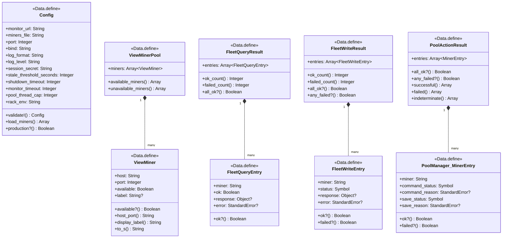
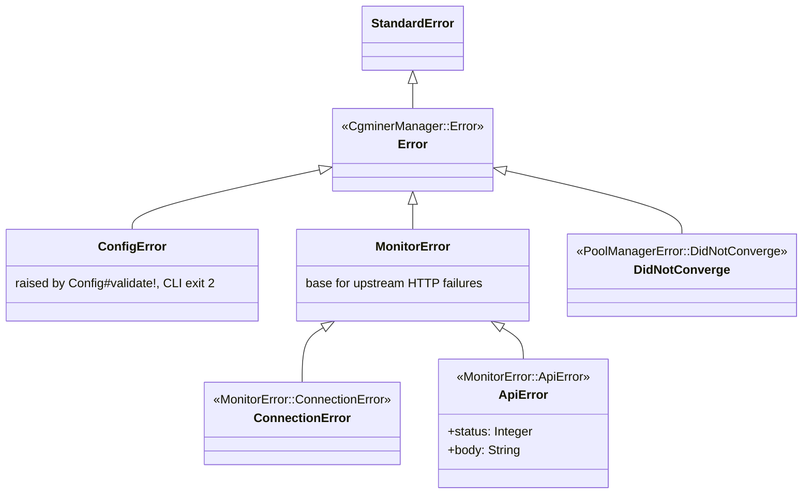

# Data Models

cgminer_manager has no database, no ORM, no migrations. "Data models" here means the runtime value objects that flow through the HTTP layer and the service classes. Every one of them is either a `Data.define` immutable value object or a Ruby hash shape derived from an upstream (cgminer_monitor JSON response, cgminer RPC JSON response, or the `miners.yml` file).

## Object graph



## Runtime value objects

### `Config`

Immutable 14-field config built from `ENV`. See `components.md` → `Config` for the full field list and defaults, and `interfaces.md` → environment-variable config for the env-var mapping.

Invariants (enforced by `#validate!`):
- `monitor_url` is set and non-empty.
- `miners_file` exists on disk.
- `log_format ∈ {"json", "text"}`.
- `log_level ∈ {"debug", "info", "warn", "error"}`.

Immutable by design; no hot reload. Restart to change.

### `ViewMiner`

Value object used in HAML partials wherever a `CgminerApiClient::Miner` instance was originally passed (in the Rails era). Built via `ViewMiner.build(host, port, available, label = nil)` which coerces `port` to Integer and normalizes empty-string labels to nil.

Public surface:
- `#host`, `#port`, `#available`, `#label` (attr readers).
- `#available?` — alias for `available`.
- `#host_port` — `"#{host}:#{port}"`.
- `#display_label` — `label || host_port`.
- `#to_s` — same as `display_label`.

Value-equality from `Data.define` matters because `_warnings.haml` does `@bad_chain_elements.uniq!`.

### `ViewMinerPool`

Wraps `Array<ViewMiner>`. Two helpers:
- `#available_miners` — `miners.select(&:available?)`.
- `#unavailable_miners` — `miners.reject(&:available?)`.

Built two ways:
- `ViewModels.build_view_miner_pool(monitor_miners, configured_miners:)` — for the dashboard, takes monitor's `/v2/miners` list (which carries `available:` flags).
- `ViewModels.build_view_miner_pool_from_yml(configured_miners:)` — for per-miner pages, builds from `configured_miners` with everyone flagged `available: false` (availability isn't needed for the pool-wide sidebar on those pages).

### `FleetQueryEntry` and `FleetQueryResult`

Returned by `CgminerCommander#version`, `#stats`, `#devs`.

`FleetQueryEntry`:
- `miner` — `"host:port"` string (from the monkey-patched `Miner#to_s`).
- `ok` — Boolean. `true` if the RPC succeeded and cgminer returned a non-error STATUS.
- `response` — the parsed cgminer response. Shape depends on the command (e.g., `{STATUS: [...], VERSION: [...]}` for `:version`).
- `error` — `StandardError` instance when `ok` is false; nil otherwise. Always one of `CgminerApiClient::{ConnectionError, TimeoutError, ApiError}`.

`FleetQueryResult`:
- `entries` — frozen array (from `Data.define`), preserving miner order.
- `#ok_count`, `#failed_count`, `#all_ok?`.

### `FleetWriteEntry` and `FleetWriteResult`

Returned by `CgminerCommander#zero!`, `#save!`, `#restart!`, `#quit!`, `#raw!`.

`FleetWriteEntry`:
- `miner` — `"host:port"` string.
- `status` — `:ok` or `:failed`. (Note the two-state model — writes don't have `:indeterminate` because there's no verification step here. Contrast with `PoolManager::MinerEntry`.)
- `response` — parsed cgminer response on success, nil on failure.
- `error` — `StandardError` on failure, nil on success.

`FleetWriteResult`:
- `entries` — frozen array, in miner order.
- `#ok_count`, `#failed_count`, `#all_ok?`, `#any_failed?`.

### `PoolManager::MinerEntry` and `PoolManager::PoolActionResult`

Returned by every `PoolManager` method.

`MinerEntry`:
- `miner` — `"host:port"`.
- `command_status` — `:ok` / `:failed` / `:indeterminate` / `:skipped` (the last is unusual; only appears for save_status).
- `command_reason` — `StandardError` when `command_status` is `:failed` or `:indeterminate`, nil otherwise.
- `save_status` — `:ok` / `:failed` / `:skipped`. `:skipped` when the command step failed (no point saving) or when the caller was `run_unverified`.
- `save_reason` — `StandardError` or nil.
- `#ok?` — both statuses are `:ok`.
- `#failed?` — `command_status == :failed` (an indeterminate command that succeeded in saving is *not* "failed"; it's still `indeterminate`).

Three-state `command_status` semantics:
- `:ok` — the write succeeded, and (for verified operations like enable/disable/remove) the post-write query confirmed the expected state.
- `:failed` — the write raised a `CgminerApiClient` error (connection, timeout, or API-level).
- `:indeterminate` — the write returned without error, but the post-write verification saw an unexpected state (raised `PoolManagerError::DidNotConverge`).

`PoolActionResult`:
- `entries` — frozen array.
- `#all_ok?`, `#any_failed?`, `#successful`, `#failed`, `#indeterminate` — the last three return sub-arrays of entries.

### Upstream: monitor's `/v2/*` envelope (consumed, not owned)

The manager parses these JSON shapes from `cgminer_monitor`. It does not define them — they belong to the monitor's contract — but it's worth summarizing what the manager relies on.

`/v2/miners`:
```json
{"miners": [{"id": "host:port", "host": "h", "port": p, "available": true, "last_poll": "2026-04-19T..."}]}
```

`/v2/miners/:id/{summary,devices,pools,stats}`:
```json
{"miner": "host:port", "command": "summary", "fetched_at": "2026-04-19T...", "ok": true,
 "response": {"STATUS": [...], "SUMMARY": [...]}, "error": null}
```

`/v2/graph_data/:metric`:
```json
{"miner": "host:port" | null, "metric": "hashrate", "since": "2026-04-19T...", "until": "2026-04-19T...",
 "fields": ["ts", "ghs_5s", "ghs_av", "device_hardware_pct", "device_rejected_pct", "pool_rejected_pct", "pool_stale_pct"],
 "data": [[1700000000, 14000000.0, ...], ...]}
```

`MonitorClient` parses these with `symbolize_names: true` so the manager sees `:miners`, `:summary`, `:fetched_at`, etc.

## Shape translations

### `SnapshotAdapter.legacy_shape`

Turns monitor's `/v2/miners/:id/:type` envelope into the shape legacy partials expect.

**Input** (monitor envelope, symbolized):
```ruby
{miner: "192.168.1.10:4028", command: "summary", fetched_at: "2026-04-19T...",
 ok: true,
 response: {"STATUS" => [...], "SUMMARY" => [{"MHS 5s" => 14000000.0, "Device Hardware%" => 0.0, ...}]},
 error: nil}
```

**Output** (legacy partial shape):
```ruby
[{summary: [{mhs_5s: 14000000.0, :"device_hardware%" => 0.0, ...}]}]
```

Translations applied:
1. `response[COMMAND_KEY_UPCASE]` → inner array. Pass-through — no key rewriting at that level.
2. Each element's keys are deeply sanitized: `downcase.tr(' ', '_').to_sym`. Note that `%` is preserved.
3. Wrap the result in `[{type: inner_array}]` so the partial can do `@miner_data[i][:summary].first[:summary]`.

Returns `nil` when the snapshot has `:error` set or `:response` is nil, letting the partials render "waiting for first poll" / "data source unavailable" placeholders.

### `SnapshotAdapter.sanitize_key`

```ruby
def self.sanitize_key(key)
  key.to_s.downcase.tr(' ', '_').to_sym
end
```

Preserves `%` verbatim: `"Device Hardware%"` → `:"device_hardware%"`. Intentional — this mirrors `cgminer_api_client::Miner#sanitized` (which the legacy partials were written against), not monitor's Poller normalization (which applies `%` → `_pct` for time-series sample metadata only).

## In-request transient state

### `@miner_data` (Array of Hashes)

Built by `HttpApp`'s dashboard and per-miner routes via `SnapshotAdapter.build_miner_data(configured_miners, snapshots)`. Shape:

```ruby
[
  {summary: [{summary: [...]}] | nil, devs: [{devs: [...]}] | nil,
   pools: [{pools: [...]}] | nil, stats: [{stats: [...]}] | nil},
  ... one per configured miner ...
]
```

Index in the outer array = index in `settings.configured_miners` = stable order from `miners.yml`.

### `@miner_pool` (ViewMinerPool)

See `ViewMinerPool` above.

### `@view` (Hash)

Returned by `ViewModels.build_dashboard` (for `/`) or `ViewModels.build_miner_view_model` (for `/miner/:id`).

Dashboard shape:
```ruby
{miners: [...monitor's miners list OR fallback...],
 snapshots: {"host:port" => {summary:, devices:, pools:, stats:}, ...},
 banner: nil | "data source unavailable (...)",
 stale_threshold: 300}
```

Per-miner shape:
```ruby
{miner_id: "host:port",
 snapshots: {summary:, devices:, pools:, stats:}}
```

Each snapshot value is either a monitor envelope (the `{miner:, command:, fetched_at:, ok:, response:, error:}` shape above) or `{error: "<msg>"}` when `safe_fetch` caught a `MonitorError`.

### `@request_id` (String, admin routes only)

`SecureRandom.uuid` set in the `before` filter when `admin_path?(request.path_info)`. Threaded through every admin audit log event in the same request. Absent on non-admin routes.

## Error class hierarchy



All gem-specific errors descend from `CgminerManager::Error < StandardError`. `rescue CgminerManager::Error` catches everything.

Where they're raised:

| Error | Raised by | Trigger |
|---|---|---|
| `ConfigError` | `Config.from_env` / `#validate!` | bad env var, missing miners.yml, invalid log config |
| `ConfigError` | `HttpApp.validate_miners_shape!` | miners.yml has wrong shape (not an Array, or an entry without `host`) |
| `MonitorError::ConnectionError` | `MonitorClient#get` | `HTTP::ConnectionError`, `HTTP::TimeoutError`, `Errno::ECONNREFUSED` |
| `MonitorError::ApiError` | `MonitorClient#get` | non-2xx HTTP response from monitor |
| `PoolManagerError::DidNotConverge` | `PoolManager#verify_pool_state`, `#verify_pool_absent` | post-write query shows unexpected pool state, or verification timed out |

`ViewModels.build_dashboard` and `ViewModels.safe_fetch` catch `MonitorError` at the boundary and produce fallback UI state rather than propagating the error to the user. The CLI (`doctor`) catches `MonitorError` and reports it as a check failure.

`PoolManagerError::DidNotConverge` is caught internally by `PoolManager#safe_call` and translated into `command_status: :indeterminate` — it never escapes to the route handler or to callers of `PoolActionResult`.
