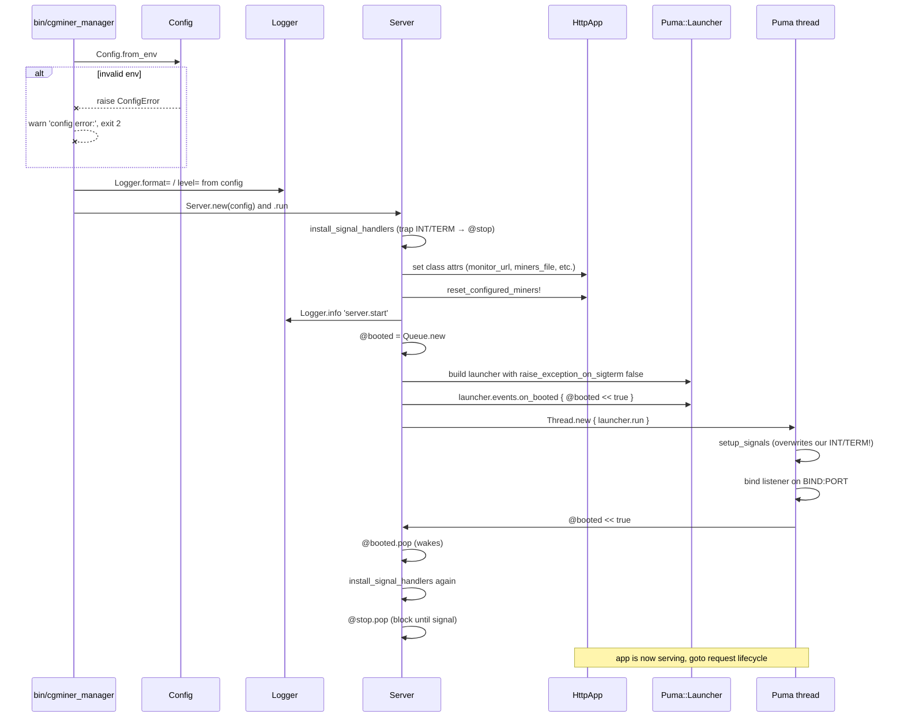
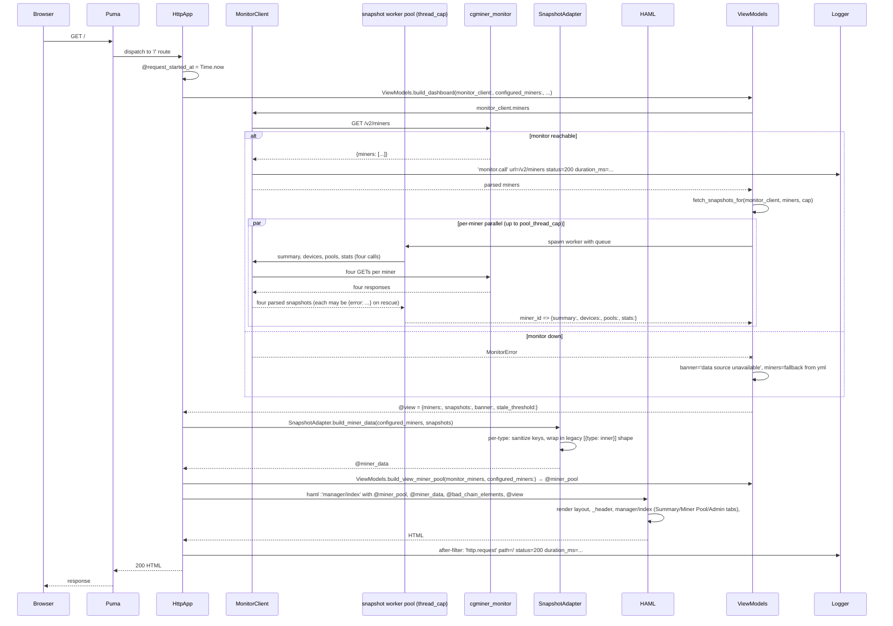
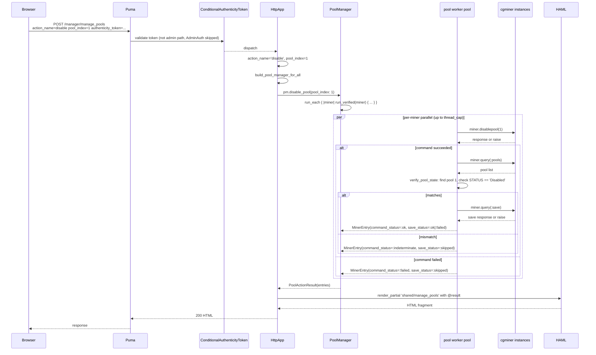
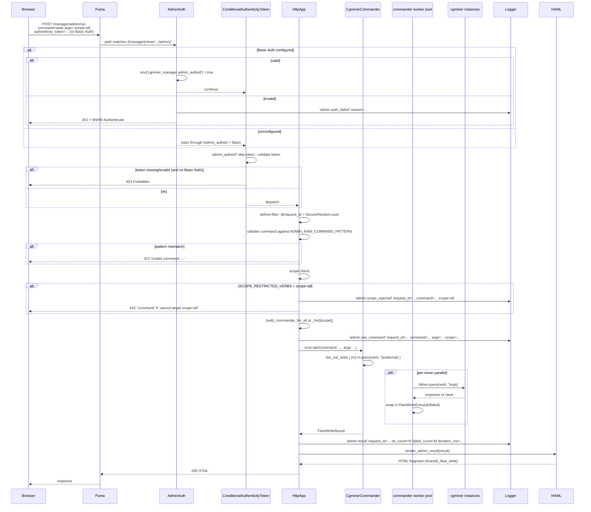
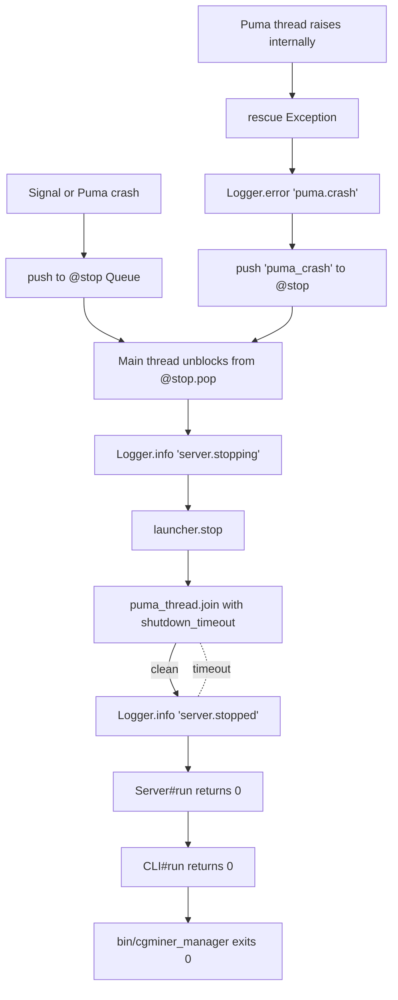

# Workflows

Four runtime flows cover essentially everything: startup, dashboard rendering, admin/pool write operations, and graceful shutdown. Plus three dev workflows: running tests, regenerating screenshots, and refreshing monitor fixtures.

## 1. Startup (`cgminer_manager run`)



**Two signal-handler installs?** Yes. Puma's `setup_signals` synchronously overwrites SIGTERM/SIGINT handlers inside its thread. We install first so a signal arriving during boot lands in `@stop`, and install again after `@booted.pop` to reclaim those signals.

**Two things can cause `cmd_run` to exit non-zero at boot:**
- `ConfigError` — CLI rescues, exits 2.
- `StandardError` escaping `Server#run` — propagates out, unhandled. Process dies and the supervisor restarts.

## 2. Dashboard render (`GET /`)



**Key observations:**
- A dashboard render with 10 miners performs 1 + 10×4 = 41 HTTP calls to monitor. With `POOL_THREAD_CAP=8` (default), the 40 per-miner calls run in parallel batches of 8.
- Each of the 40 per-miner calls independently catches `MonitorError` and turns it into `{error: "..."}`. A single bad tile doesn't fail the whole dashboard.
- The top-level `ViewModels.build_dashboard` rescue handles the "can't even enumerate miners" case — it falls back to `configured_miners` from `miners.yml` with no availability data and sets a banner.
- `@miner_pool` drives the "Miner Pool" tab (availability status from monitor). `@miner_data` drives the "Summary" tab (per-miner hashrate and devices tables). Graph canvases on Summary pull their data from `/graph_data/:metric` via Chart.js after page load.

## 3. Pool management flow (`POST /manager/manage_pools`)



**Key observations:**
- Every verified pool op runs a post-write query to confirm state. `:indeterminate` is the third result state for "the RPC succeeded but the world isn't what we expect."
- `save_status: :skipped` when the command step failed. No point saving an unchanged state.
- `add_pool` is unverified (cgminer's response doesn't give the new pool index deterministically). `save_status` is always `:skipped` for unverified ops; callers run `save` explicitly.

## 4. Admin flow (`POST /manager/admin/run`)



**Key observations:**
- Entry (`admin.raw_command` or `admin.command`), rejection (`admin.scope_rejected`, `admin.auth_failed`), and exit (`admin.result`) events all share the same `request_id`. Grep logs by `request_id` to see one operation end-to-end.
- Typed-allowlist admin routes (`/manager/admin/:command`) skip the `ADMIN_RAW_COMMAND_PATTERN` check (they use an enum match instead) and don't have `args` — they map directly to the commander's named methods.

## 5. Graceful shutdown



`puma_thread.join(shutdown_timeout)` returns nil if Puma hasn't stopped within `SHUTDOWN_TIMEOUT` seconds; we move on regardless. Worst case the supervisor sends SIGKILL and Puma dies mid-request.

## 6. Local dev: running tests

```sh
bundle install
bundle exec rake                                   # rubocop + rspec (full suite)
bundle exec rspec --tag ~integration               # unit only (CI matrix runs this)
bundle exec rspec --tag integration                # integration only
bundle exec rspec path/to/spec.rb:123              # single example
bundle exec rubocop                                # lint only
bundle exec rubocop -A                             # lint + auto-correct
```

Coverage via SimpleCov, enforced at the default rake task (`ENFORCE_COVERAGE=1` implicit). Reports land in `coverage/`.

No MongoDB or live cgminer required locally. Integration specs use:
- **WebMock** to stub monitor's `/v2/*` (see `spec/support/monitor_stubs.rb`).
- **FakeCgminer** TCP server (see `spec/support/fake_cgminer.rb`) for the few specs that exercise the cgminer side directly.

## 7. Regenerating screenshots

The `dev/screenshots/` harness is separate from the spec suite. It spins up a **real** cgminer fleet (6 TCP listeners at `127.0.0.1:40281..40286`), a fake monitor, and a manager process, then drives Playwright through the UI to capture PNGs for `public/screenshots/`.

```sh
cd dev/screenshots
./boot.sh       # launches fake_cgminer_fleet, fake_monitor, manager
# ... runs Playwright scenario.rb ...
./teardown.sh   # cleanly shuts everything down
```

Logs land in `dev/screenshots/.run/*.log`. See `dev/screenshots/README.md` for details.

## 8. Refreshing monitor fixtures

`Rakefile` provides `rake spec:refresh_monitor_fixtures` for capturing live monitor responses into `spec/fixtures/monitor/*.json`:

```sh
CGMINER_MONITOR_URL=http://monitor.local:9292 \
  CGMINER_FIXTURE_MINER_ID=192.168.1.10:4028 \
  bundle exec rake spec:refresh_monitor_fixtures
```

Fetches `/v2/miners`, per-miner `{summary, devices, pools, stats}`, `/v2/graph_data/hashrate`, and `/v2/healthz` for the named miner. Writes them as `miners.json`, `summary.json`, etc. Useful after a monitor version bump when the envelope shape changes.

## 9. Release

Not automated. On a clean `master`:

```sh
bundle exec rake                                    # must pass
# bump VERSION in lib/cgminer_manager/version.rb
# update CHANGELOG.md (Keep-a-Changelog format)
git commit -am "Release vX.Y.Z"
gem build cgminer_manager.gemspec                   # produces cgminer_manager-X.Y.Z.gem
gem push cgminer_manager-X.Y.Z.gem                  # requires 2FA (rubygems_mfa_required=true)
git tag vX.Y.Z
git push origin master vX.Y.Z
```

Docker image is not currently pushed by CI. If that changes later, it'd be a separate workflow triggered on tag push.

## 10. Docker Compose dev stack

`docker-compose.yml` wires manager, monitor, and Mongo together:

```sh
export SESSION_SECRET=$(ruby -rsecurerandom -e 'puts SecureRandom.hex(32)')
cp config/miners.yml.example config/miners.yml
docker compose up
```

Opens on `http://localhost:3000`. See README for Basic Auth env vars to add when exposing beyond localhost.
